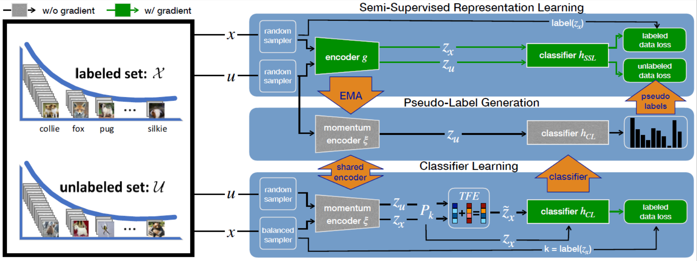

# CoSSL: Co-Learning of Representation and Classifier for Imbalanced Semi-Supervised Learning
[](https://github.com/YUE-FAN/CoSSL/blob/main/LICENSE)
[](https://www.python.org/)
[](https://pytorch.org/)

This repository contains the PyTorch implementation for the [CVPR 2022](http://cvpr2022.thecvf.com/) Paper ["CoSSL: Co-Learning of Representation and Classifier for Imbalanced Semi-Supervised Learning"](https://arxiv.org/abs/2112.04564) by [Yue Fan](https://www.mpi-inf.mpg.de/departments/computer-vision-and-machine-learning/people/yue-fan), [Dengxin Dai](https://people.ee.ethz.ch/~daid/), [Anna Kukleva](https://annusha.github.io/), and [Bernt Schiele](https://www.mpi-inf.mpg.de/departments/computer-vision-and-multimodal-computing/people/bernt-schiele/).

If you have any questions on this repository or the related paper, feel free to [create an issue](https://github.com/YUE-FAN/CoSSL/issues/new) or [send me an email](mailto:yfan@mpi-inf.mpg.de). 


#### Summary

* [Introduction](#introduction)
* [Installation](#installation)
* [Running Experiments](#running-experiments)
* [Performance](#performance)
* [Citation](#citation)
* [Acknowledgements](#acknowledgements)

#### 📚 完整文档

* **[PROJECT_GUIDE.md](PROJECT_GUIDE.md)** - 完整的项目使用指南（中文）
  - 详细的训练脚本使用说明
  - 参数配置指南
  - 辅助工具使用方法
  - 常见问题解答
* **[TRAINING_METRICS_EXPLAINED.md](TRAINING_METRICS_EXPLAINED.md)** - 训练指标详解（中文）
  - 所有训练和验证指标的详细说明
  - 指标计算方法和解读方式
  - 针对不平衡数据集的特殊意义

## Introduction

Standard semi-supervised learning (SSL) using class-balanced datasets has shown great progress to leverage unlabeled data effectively. However, the more realistic setting of class-imbalanced data - called imbalanced SSL - is largely underexplored and standard SSL tends to underperform. In this paper, we propose a novel co-learning framework (CoSSL), which decouples representation and classifier learning while coupling them closely. To handle the data imbalance, we devise Tail-class Feature Enhancement (TFE) for classifier learning. Furthermore, the current evaluation protocol for imbalanced SSL focuses only on balanced test sets, which has limited practicality in real-world scenarios. Therefore, we further conduct a comprehensive evaluation under various shifted test distributions. In experiments, we show that our approach outperforms other methods over a large range of shifted distributions, achieving state-of-the-art performance on benchmark datasets ranging from CIFAR-10, CIFAR-100, ImageNet, to Food-101.  

<p align="center">
    
</p>

> Figure: Our co-learning framework CoSSL decouples the training of representation and classifier while coupling them in a non-gradient manner. CoSSL consists of three modules: a semi-supervised representation learning module, a balanced classifier learning module, and a carefully designed pseudo-label generation module. The representation module provides a momentum encoder for feature extraction in the other two modules, and the classifier module produces a balanced classifier using our novel Tail-class Feature Enhancement (TFE). Then, pseudo-label module generates pseudo-labels for the representation module using the momentum encoder and the balanced classifier. The interplay between these modules enhances each other, leading to both a more powerful representation and a more balanced classifier. Additionally, our framework is flexible as it can accommodate any standard SSL methods and classifier learning methods.


## Installation

* `python 3.7`
* `pytorch == 1.0.0`
* `torchvision == 0.2.2.post3`
* `randAugment (Pytorch re-implementation: https://github.com/ildoonet/pytorch-randaugment)`
* `torchvision`
* `progressbar`

## Running Experiments

We provide `run*.sh` for reproducing results in our paper.


### Example
Here is an example of running CoSSL on CIFAR-10 at imbalance ratio 150 with FixMatch backbone:

Run pretrain phase:
```
python train_cifar_fix.py --ratio 2 --num_max 1500 --imb_ratio_l 150 --imb_ratio_u 150 --epoch 500 --val-iteration 500 --out ./results/cifar10/fixmatch/baseline/wrn28_N1500_r150_seed1 --manualSeed 1 --gpu 2
```
Applying CoSSL:
```
python train_cifar_fix_cossl.py --ratio 2 --num_max 1500 --imb_ratio_l 150 --imb_ratio_u 150 --epoch 100 --val-iteration 500 --resume ./results/cifar10/fixmatch/baseline/wrn28_N1500_r150_seed1/checkpoint_401.pth.tar --out ./results/cifar10/fixmatch/cossl/wrn28_N1500_r150_lam06_seed1 --max_lam 0.6 --manualSeed 1 --gpu 0
```


## Performance

| Test Acc. (%)      |  CIFAR-10-LT γ=50  |  CIFAR-10-LT γ=100  |  CIFAR-10-LT γ=150  |
|--------------------|:------------------:|:-------------------:|:-------------------:|
| `MixMatch+CoSSL`   |   `80.3 ± 0.31`    |    `76.4 ± 1.14`    |    `73.5 ± 1.25`    |
| `ReMixMatch+CoSSL` |   `87.7 ± 0.21`    |    `84.1 ± 0.56`    |    `81.3 ± 0.83`    |
| `FixMatch+CoSSL`   |   `86.8 ± 0.30`    |    `83.2 ± 0.49`    |    `80.3 ± 0.55`    |

| Test Acc. (%)      |  CIFAR-100-LT γ=20  | CIFAR-100-LT γ=50  |  CIFAR-100-LT γ=100  |
|--------------------|:-------------------:|:-------------------|:--------------------:|
| `ReMixMatch+CoSSL` |    `55.8 ± 0.62`    | `48.9 ± 0.61`      |    `44.1 ± 0.59`     |
| `FixMatch+CoSSL`   |    `53.9 ± 0.78`    | `47.6 ± 0.57`      |    `43.0 ± 0.61`     |

| Test Acc. (%)      |  Food-101-LT γ=50  |  Food-101-LT γ=100  |
|--------------------|:------------------:|:-------------------:|
| `FixMatch+CoSSL`   |       `49.0`       |       `40.4`        |

| Test Acc. (%)      |  Small-ImageNet-127 32x32  |  Small-ImageNet-127 64x64  |
|--------------------|:--------------------------:|:--------------------------:|
| `FixMatch+CoSSL`   |           `43.7`           |           `54.4`           |

* The performance for the PyTorch version is under checking.

## Citation

Please cite our paper if it is helpful to your work:

```bibtex
@inproceedings{fan2021cossl,
title={CoSSL: Co-Learning of Representation and Classifier for Imbalanced Semi-Supervised Learning},
author={Fan, Yue and Dai, Dengxin and Kukleva, Anna and Schiele, Bernt},
booktitle = {The IEEE Conference on Computer Vision and Pattern Recognition (CVPR)},
year = {2022}
}
```

## Acknowledgements

Our implementations use the source code from the following repositories and users:

* [DARP: Distribution Aligning Refinery of Pseudo-label for Imbalanced Semi-supervised Learning](https://github.com/bbuing9/DARP)

* [@kekmodel](https://github.com/kekmodel/FixMatch-pytorch)

* [@yaoyao-liu](https://github.com/yaoyao-liu/meta-transfer-learning)
